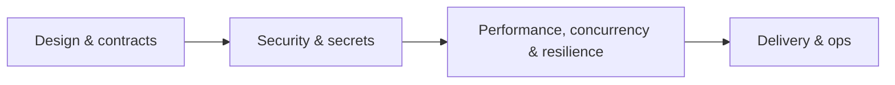

# secure-dotnet-skills v2 — Polish + Four New Skills — Implementation Plan

> **For agentic workers:** REQUIRED SUB-SKILL: Use superpowers:subagent-driven-development (recommended) or superpowers:executing-plans to implement this plan task-by-task. Steps use checkbox (`- [ ]`) syntax for tracking.

**Goal:** Ship secure-dotnet-skills 0.2.0 — add a structural validator + CI + markdownlint, four new skills (api-contract, resilience, rate-limiting, container-deployment), cross-references, and an enriched README, growing the collection from 12 to 16 skills.

**Architecture:** A flat collection of independent `skills/<name>/SKILL.md` units (+ `examples/<name>/`), guarded by a thin pure Node validator run via `node --test`. New skills follow the v1 authoring contract; cross-references are documentation links.

**Tech Stack:** Markdown `SKILL.md` (open standard), Node ≥18 ESM validator (`node --test`, no deps), GitHub Actions + markdownlint-cli2, Claude Code plugin manifest.

## Global Constraints

- This is the `secure-dotnet-skills` repository (published at `github.com/tunahanaliozturk/secure-dotnet-skills`). All paths relative to its root.
- Release version `0.2.0`, equal in `.claude-plugin/plugin.json`, `.claude-plugin/marketplace.json`, and `package.json` (the validator asserts plugin == marketplace and == `0.2.0`).
- Every `skills/<name>/SKILL.md` MUST have: frontmatter `name` (== folder) and `description` starting `Use when`; sections in order `## When to use`, `## Process`, `## .NET / Azure checks`, `## Red flags`, `## Example`; the Example section links to `examples/<name>/` and `examples/<name>/README.md` must exist. An optional `## Related skills` section may follow `## Example`.
- New skills are ASP.NET Core / Azure–specific and concrete (real types/attributes/APIs/config). Generic advice is a defect. Each ships a worked before/after example.
- Quality gate per new skill: `node --test` (structural validator) green AND `skill-reviewer` agent approval AND a worked example.
- No third-party runtime deps. `node --test` runs from the repo root. Run all commands from the repo root.

---

### Task 1: Toolchain + structural validator + version bump

**Files:**
- Create: `package.json`
- Create: `test/frontmatter.mjs`
- Create: `test/structure.test.mjs`
- Modify: `.claude-plugin/plugin.json` (version → 0.2.0)
- Modify: `.claude-plugin/marketplace.json` (plugin entry version → 0.2.0)

**Interfaces:**
- Produces: `parseFrontmatter(text) -> { data: { name, description, ... }, body }`; a `node --test` suite that validates every skill folder and manifest version parity.

- [ ] **Step 1: Bump the manifest versions to 0.2.0**

In `.claude-plugin/plugin.json` set `"version": "0.2.0"`. In `.claude-plugin/marketplace.json` set the `secure-dotnet-skills` plugin entry `"version": "0.2.0"`.

- [ ] **Step 2: Create `package.json`**

```json
{
  "name": "secure-dotnet-skills",
  "version": "0.2.0",
  "description": "Judgment agent skills for secure, production-grade .NET on Azure.",
  "type": "module",
  "private": true,
  "scripts": {
    "test": "node --test"
  },
  "engines": {
    "node": ">=18"
  },
  "license": "MIT"
}
```

- [ ] **Step 3: Create the frontmatter parser `test/frontmatter.mjs`**

```js
// Minimal YAML-frontmatter reader for SKILL.md files. No third-party deps.
export function parseFrontmatter(text) {
  const m = text.match(/^---\n([\s\S]*?)\n---/);
  if (!m) return { data: {}, body: text };
  const data = {};
  for (const line of m[1].split('\n')) {
    const kv = line.match(/^([A-Za-z0-9_]+):\s*(.*)$/);
    if (kv) data[kv[1]] = kv[2].trim();
  }
  return { data, body: text.slice(m[0].length) };
}
```

- [ ] **Step 4: Create the validator `test/structure.test.mjs`**

```js
import { test } from 'node:test';
import assert from 'node:assert/strict';
import { readdirSync, readFileSync, existsSync, statSync } from 'node:fs';
import { join } from 'node:path';
import { parseFrontmatter } from './frontmatter.mjs';

const REQUIRED = [
  '## When to use',
  '## Process',
  '## .NET / Azure checks',
  '## Red flags',
  '## Example',
];

const skillDirs = readdirSync('skills').filter((d) => statSync(join('skills', d)).isDirectory());

test('the collection has skills', () => {
  assert.ok(skillDirs.length >= 12, `expected >= 12 skills, found ${skillDirs.length}`);
});

for (const name of skillDirs) {
  test(`skill ${name} is well-formed`, () => {
    const path = join('skills', name, 'SKILL.md');
    assert.ok(existsSync(path), `${name}: missing SKILL.md`);
    const text = readFileSync(path, 'utf8');
    const { data } = parseFrontmatter(text);
    assert.equal(data.name, name, `${name}: frontmatter name must equal the folder name`);
    assert.ok(
      data.description && data.description.startsWith('Use when'),
      `${name}: description must start with "Use when"`,
    );
    let last = -1;
    for (const section of REQUIRED) {
      const idx = text.indexOf(`\n${section}`);
      assert.notEqual(idx, -1, `${name}: missing section "${section}"`);
      assert.ok(idx > last, `${name}: section "${section}" is out of order`);
      last = idx;
    }
    assert.ok(
      existsSync(join('examples', name, 'README.md')),
      `${name}: missing examples/${name}/README.md`,
    );
    assert.match(text, new RegExp(`examples/${name}/`), `${name}: Example must link to examples/${name}/`);
  });
}

test('manifests agree on version 0.2.0 and the skills path', () => {
  const plugin = JSON.parse(readFileSync('.claude-plugin/plugin.json', 'utf8'));
  const market = JSON.parse(readFileSync('.claude-plugin/marketplace.json', 'utf8'));
  assert.equal(plugin.skills, './skills/');
  assert.equal(plugin.version, '0.2.0');
  const entry = market.plugins.find((p) => p.name === plugin.name);
  assert.ok(entry, 'plugin not listed in marketplace');
  assert.equal(entry.version, plugin.version);
});
```

- [ ] **Step 5: Run the validator against the existing 12 skills**

Run: `node --test`
Expected: PASS. This is a validator over already-conforming content, so it should pass immediately. If any test FAILS, it has found a real pre-existing defect (a dropped section, a non-"Use when" description, or a broken example link) — fix that skill's content to satisfy the contract, then re-run. Do not weaken the validator to pass.

- [ ] **Step 6: Commit**

```bash
git add package.json test/frontmatter.mjs test/structure.test.mjs .claude-plugin/plugin.json .claude-plugin/marketplace.json
git commit -m "feat: add structural validator + toolchain; bump to 0.2.0"
```

---

### Task 2: CI + markdownlint

**Files:**
- Create: `.github/workflows/ci.yml`
- Create: `.markdownlint-cli2.jsonc`

**Interfaces:**
- Produces: CI that runs `node --test` and markdownlint on push/PR.

- [ ] **Step 1: Create `.markdownlint-cli2.jsonc` (lenient)**

```jsonc
{
  // Lenient config for skill content: disable rules that are formatting taste,
  // keep the rules that catch real breakage.
  "config": {
    "MD013": false, // line length — prose and code samples run long
    "MD033": false, // inline HTML — allowed where needed
    "MD041": false, // first line heading — files lead with YAML frontmatter
    "MD024": { "siblings_only": true } // duplicate headings only flagged among siblings
  },
  "globs": ["**/*.md"],
  "ignores": ["node_modules", "docs/superpowers/**"]
}
```

- [ ] **Step 2: Create `.github/workflows/ci.yml`**

```yaml
name: CI

on:
  push:
  pull_request:

jobs:
  validate:
    runs-on: ubuntu-latest
    steps:
      - uses: actions/checkout@v4
      - uses: actions/setup-node@v4
        with:
          node-version: '20.x'
      - name: Structural validator
        run: node --test
      - name: Markdownlint
        uses: DavidAnson/markdownlint-cli2-action@v19
        with:
          globs: '**/*.md'
```

- [ ] **Step 3: Verify locally**

Run: `node --test`
Expected: PASS. Confirm `.github/workflows/ci.yml` and `.markdownlint-cli2.jsonc` are valid (YAML has no tabs; JSONC parses ignoring comments).

- [ ] **Step 4: Commit**

```bash
git add .github/workflows/ci.yml .markdownlint-cli2.jsonc
git commit -m "ci: run structural validator and markdownlint on push and PRs"
```

---

### Task 3: Skill — api-contract-review

**Files:**
- Create: `skills/api-contract-review/SKILL.md`
- Create: `examples/api-contract-review/README.md`

Follow the v1 authoring contract (frontmatter; `## When to use`; numbered `## Process`; `## .NET / Azure checks`; `## Red flags` table; `## Example` link; then `## Related skills`). Content:

- **`description`:** `Use when reviewing the design of a REST/HTTP API in ASP.NET Core — resource modeling, status codes, error shape, idempotency, versioning, pagination, and OpenAPI accuracy — before it ships.`
- **Process:** (1) enumerate the resources and verbs; (2) check status-code correctness; (3) check the error contract; (4) check idempotency and verb safety; (5) check versioning, pagination, content negotiation; (6) check the OpenAPI document matches reality; (7) output findings with the concrete fix.
- **.NET / Azure checks (must include, concrete):**
  - Verb semantics: GET safe + idempotent (no side effects), POST create, PUT idempotent full replace, PATCH partial (`JsonPatch`/merge-patch), DELETE idempotent.
  - Status codes: `201 Created` + `Location` header on create; `204 No Content` on empty success; `400` (malformed) vs `422` (semantically invalid) vs `409` (conflict); `404` vs `403`; `412` for failed precondition.
  - Error contract: `ProblemDetails` / `ValidationProblemDetails` (RFC 7807) via `Results.Problem` / `Results.ValidationProblem` / `AddProblemDetails`, not ad-hoc `{ "error": "..." }` JSON.
  - Idempotency: an `Idempotency-Key` for unsafe, non-idempotent POSTs (payments/orders) so retries don't double-act.
  - Concurrency: optimistic concurrency over HTTP with `ETag` + `If-Match` → `412 Precondition Failed`.
  - Versioning: an explicit strategy via `Asp.Versioning` (URL segment or header), not breaking changes on an unversioned route.
  - Pagination: bounded page size, cursor or offset with a documented `next` token/`Link` header; never an unbounded list.
  - Content negotiation: honor `Accept`; consistent media types.
  - OpenAPI: `Microsoft.AspNetCore.OpenApi` / Swashbuckle document matches real responses (`[ProducesResponseType]` for each status, DTOs not entities).
- **Red flags:** `200 OK` with an error body on failure; POST that creates but returns `200` with no `Location`; an unbounded list endpoint; stringly-typed error bodies; an unversioned public route; `PUT` used for partial updates; EF entities returned straight to the client.
- **Example (`examples/api-contract-review/README.md`):** a `POST /orders` returning `200` + `{ "error": "invalid" }` on bad input and no idempotency → fixed: `422 ValidationProblemDetails` on invalid, `201 Created` + `Location` + `Idempotency-Key` handling on success.
- **`## Related skills`:** `design-dotnet-feature` (feature design), `auth-flow-review` (authz on endpoints), `rate-limiting-review` (429 + Retry-After).

- [ ] **Step 1: Write `skills/api-contract-review/SKILL.md`** per the contract and content above.
- [ ] **Step 2: Write `examples/api-contract-review/README.md`** (before/after).
- [ ] **Step 3: Run `node --test`** — the validator now also checks this new skill; expect PASS.
- [ ] **Step 4: Commit** — `feat: add api-contract-review skill`

---

### Task 4: Skill — resilience-review

**Files:**
- Create: `skills/resilience-review/SKILL.md`
- Create: `examples/resilience-review/README.md`

Follow the contract. Content:

- **`description`:** `Use when reviewing how a .NET service handles transient faults and downstream failures — timeouts, retries, circuit breakers, bulkheads, and fallback — for calls to databases, queues, and HTTP dependencies.`
- **Process:** (1) map the outbound dependencies (HTTP, DB, queue, cache); (2) confirm each call has a per-attempt timeout and an overall deadline; (3) check the retry policy; (4) check circuit breaker and bulkhead isolation; (5) check fallback/graceful degradation; (6) check cancellation propagation; (7) output findings.
- **.NET / Azure checks (must include):**
  - `Microsoft.Extensions.Http.Resilience` `AddStandardResilienceHandler()` on typed clients, or Polly v8 `ResiliencePipelineBuilder`.
  - Per-attempt timeout AND a total timeout/deadline; never an unbounded wait.
  - Retries only for idempotent operations and transient faults (`HttpRequestException`, 5xx, 408, honoring `429`/`Retry-After`), with exponential backoff + jitter and a bounded attempt count.
  - Circuit breaker to stop hammering a downed dependency; bulkhead/concurrency limiter to isolate one slow dependency from exhausting the thread/connection pool.
  - Fallback: a cached, default, or degraded response when the dependency is unavailable.
  - `CancellationToken` honored end-to-end; deadlines propagated across hops.
  - `IHttpClientFactory` typed clients (not `new HttpClient()`); EF Core `EnableRetryOnFailure` for transient DB faults.
  - Idempotency as a retry precondition: do not blindly retry a non-idempotent POST.
- **Red flags:** an `HttpClient` call with no timeout or cancellation; retrying every operation including non-idempotent writes; infinite/unbounded retries; retries with no backoff (thundering herd); no circuit breaker on a known-flaky dependency; a catch-all that swallows failures and returns success; hand-rolled `Task.Delay` retry loops.
- **Example:** a typed client calling a payment API with no timeout/retry/breaker → a standard resilience pipeline: timeout + jittered retry on the idempotent read + circuit breaker + a cached fallback.
- **`## Related skills`:** `dotnet-performance-review`, `async-concurrency-review`.

- [ ] **Step 1: Write the SKILL.md.**
- [ ] **Step 2: Write the example.**
- [ ] **Step 3: Run `node --test`** — expect PASS.
- [ ] **Step 4: Commit** — `feat: add resilience-review skill`

---

### Task 5: Skill — rate-limiting-review

**Files:**
- Create: `skills/rate-limiting-review/SKILL.md`
- Create: `examples/rate-limiting-review/README.md`

Follow the contract. Content:

- **`description`:** `Use when reviewing rate limiting and overload protection in an ASP.NET Core app — limiter algorithm, partitioning, 429 semantics, and where limiting belongs — to protect against abuse and overload.`
- **Process:** (1) identify the resources to protect and the threat (abuse, scraping, cost, DoS, brute force); (2) choose the algorithm; (3) choose the partition key; (4) set rejection semantics; (5) decide gateway vs app placement and per-instance vs distributed; (6) output findings.
- **.NET / Azure checks (must include):**
  - `builder.Services.AddRateLimiter(...)` + `app.UseRateLimiter()`; the built-in algorithms: fixed window, sliding window, token bucket, concurrency limiter — matched to the use case.
  - Partitioning via `RateLimitPartition.Get*Limiter(partitionKey, ...)` by API key / authenticated user / client — not a raw IP that collapses many users behind a NAT or load balancer.
  - `X-Forwarded-For` only trusted behind a configured known proxy (`ForwardedHeadersOptions` / `KnownProxies`); otherwise it is spoofable.
  - Rejection: `RejectionStatusCode = 429` (not 503) and a `Retry-After` header (via `OnRejected`); sensible `QueueLimit` / `QueueProcessingOrder`.
  - Per-endpoint policies with `RequireRateLimiting("policy")`; protect expensive and anonymous endpoints, and login/auth endpoints to slow brute force; do not throttle health checks.
  - Multi-instance: an in-memory limiter is per-instance — for a global limit use a distributed (e.g. Redis-backed) limiter or enforce at the gateway (APIM / Front Door).
- **Red flags:** no limiting on login or on expensive anonymous endpoints; partitioning by raw client IP behind a load balancer (everyone shares one bucket); returning `503` instead of `429`; no `Retry-After`; an in-memory limiter on a horizontally scaled deployment; trusting `X-Forwarded-For` without configured known proxies.
- **Example:** an unprotected `POST /search` (expensive, anonymous) → a token-bucket limiter partitioned by API key, `429` + `Retry-After`, applied with `RequireRateLimiting`.
- **`## Related skills`:** `threat-model-endpoint` (DoS), `api-contract-review` (429 contract).

- [ ] **Step 1: Write the SKILL.md.**
- [ ] **Step 2: Write the example.**
- [ ] **Step 3: Run `node --test`** — expect PASS.
- [ ] **Step 4: Commit** — `feat: add rate-limiting-review skill`

---

### Task 6: Skill — container-deployment-review

**Files:**
- Create: `skills/container-deployment-review/SKILL.md`
- Create: `examples/container-deployment-review/README.md`

Follow the contract. Content:

- **`description`:** `Use when reviewing how a .NET app is containerized and deployed — Dockerfile, base image, runtime user, configuration, health probes, resources, and secrets — before it runs in Kubernetes or Azure Container Apps.`
- **Process:** (1) review the Dockerfile (build + runtime stages); (2) check the runtime user and base image; (3) check configuration and secret handling; (4) check health probes and graceful shutdown; (5) check resource limits and image scanning; (6) output findings.
- **.NET / Azure checks (must include):**
  - Multi-stage build: an SDK stage (`mcr.microsoft.com/dotnet/sdk`) for `restore`/`publish`, a slim runtime stage (`.../dotnet/aspnet` or a chiseled/distroless image) that ships only the published output — never the SDK in production.
  - Non-root: run as a non-root user (`USER $APP_UID` / `USER app`; .NET 8+ images and chiseled images support non-root); bind to port 8080 (`ASPNETCORE_HTTP_PORTS=8080`) rather than 80 as root.
  - Secrets: never baked into image layers — no secrets in `ENV`/`ARG`, no committed `appsettings.*.json` with secrets; inject at runtime via platform secrets / Key Vault (CSI driver or references) / env.
  - Config: correct `ASPNETCORE_ENVIRONMENT`, `ASPNETCORE_URLS`/`HTTP_PORTS`; container-aware GC and limits (`DOTNET_gcServer`, the runtime respects cgroup limits).
  - Health: `MapHealthChecks` endpoints wired to liveness and readiness probes; graceful shutdown on SIGTERM (`IHostApplicationLifetime`, `ShutdownTimeout`).
  - Resources & supply chain: CPU/memory requests and limits set; a `.dockerignore` excluding `bin`/`obj`/secrets; pinned base image tags (ideally by digest), not `latest`; image scanning (Trivy / Microsoft Defender); read-only root filesystem where feasible.
- **Red flags:** a single-stage Dockerfile shipping the SDK; `USER root` or no `USER` directive; a secret in `ENV`/`ARG` or a copied `appsettings.Production.json`; a `latest` base tag; no health probes; no resource limits; binding to port 80 as root; a missing `.dockerignore`.
- **Example:** a single-stage, root-running Dockerfile with `ENV ConnectionStrings__Default=...` → a hardened multi-stage chiseled non-root image, secrets via the platform, and liveness/readiness probes.
- **`## Related skills`:** `azure-hardening-review` (Bicep / App Service hardening).

- [ ] **Step 1: Write the SKILL.md.**
- [ ] **Step 2: Write the example.**
- [ ] **Step 3: Run `node --test`** — expect PASS.
- [ ] **Step 4: Commit** — `feat: add container-deployment-review skill`

---

### Task 7: Cross-references on existing skills

**Files:**
- Modify (add a `## Related skills` section after `## Example`): `skills/ef-core-review/SKILL.md`, `skills/dotnet-performance-review/SKILL.md`, `skills/secrets-config-audit/SKILL.md`, `skills/dotnet-security-review/SKILL.md`, `skills/async-concurrency-review/SKILL.md`, `skills/azure-hardening-review/SKILL.md`, `skills/threat-model-endpoint/SKILL.md`, `skills/design-dotnet-feature/SKILL.md`, `skills/auth-flow-review/SKILL.md`

**Interfaces:**
- Produces: bidirectional documentation links between overlapping skills. The validator already tolerates a trailing `## Related skills` section.

- [ ] **Step 1: Add `## Related skills` to each listed skill**

Append a `## Related skills` section (after the `## Example` section) to each file, with these links (use the skill name as a relative link to its folder, e.g. `[dotnet-performance-review](../dotnet-performance-review/SKILL.md)`):
- `ef-core-review` → `dotnet-performance-review` (broad perf), `dotnet-security-review` (raw-SQL injection).
- `dotnet-performance-review` → `ef-core-review` (query perf), `resilience-review` (downstream calls).
- `secrets-config-audit` → `dotnet-security-review` (full review), `azure-hardening-review` (Key Vault / RBAC).
- `dotnet-security-review` → `secrets-config-audit` (secrets depth), `threat-model-endpoint` (per-endpoint threats), `auth-flow-review` (authn/z depth).
- `async-concurrency-review` → `dotnet-performance-review` (perf), `resilience-review` (timeouts/cancellation).
- `azure-hardening-review` → `container-deployment-review` (container delivery), `secrets-config-audit` (Key Vault).
- `threat-model-endpoint` → `rate-limiting-review` (DoS), `dotnet-security-review` (review).
- `design-dotnet-feature` → `api-contract-review` (API design), `solid-review` (principles).
- `auth-flow-review` → `dotnet-security-review` (review), `api-contract-review` (endpoint contracts).

Keep each section to a short bulleted list of `- [name](../name/SKILL.md) — one-clause reason`.

- [ ] **Step 2: Run `node --test`** — expect PASS (the validator allows the trailing section; nothing it asserts changed).

- [ ] **Step 3: Commit** — `docs: cross-reference overlapping skills`

---

### Task 8: README enrichment + CHANGELOG

**Files:**
- Modify: `README.md`
- Create: `CHANGELOG.md`

**Interfaces:**
- Consumes: all 16 skills, CI, and the version bump.

- [ ] **Step 1: Add badges under the title in `README.md`**

Immediately under the `# Secure .NET on Azure Skills — Aegis` title (before the first paragraph), add:
```markdown


```

- [ ] **Step 2: Add a lifecycle visual before the `## Skills` section**

````markdown
## Where the skills apply


````

- [ ] **Step 3: Replace the `## Skills` section with the regrouped 16-skill table**

Replace the existing Skills section body with four grouped subsections, each a table of `| Skill | Use when |` rows whose "Use when" text is each skill's frontmatter `description` (trimmed to its essence) and whose Skill cell links to `skills/<name>/SKILL.md`:

- **Security & secrets:** dotnet-security-review, threat-model-endpoint, secrets-config-audit, auth-flow-review, dependency-supplychain-check, rate-limiting-review.
- **Design & contracts:** design-dotnet-feature, solid-review, api-contract-review.
- **Performance, concurrency & resilience:** dotnet-performance-review, async-concurrency-review, ef-core-review, resilience-review.
- **Delivery & ops:** azure-hardening-review, container-deployment-review, observability-review.

(Read each skill's `description` from its SKILL.md to fill the "Use when" cell accurately.)

- [ ] **Step 4: Create `CHANGELOG.md`**

```markdown
# Changelog

All notable changes are documented here. The format is based on Keep a Changelog and the
project adheres to Semantic Versioning.

## [0.2.0] - 2026-06-20

### Added
- Four new skills: `api-contract-review`, `resilience-review`, `rate-limiting-review`, `container-deployment-review` (16 skills total).
- Structural validator (`test/structure.test.mjs`) run via `node --test`: checks every skill's frontmatter, required sections, and example-link resolution, plus manifest version parity.
- Continuous integration (GitHub Actions): the structural validator and markdownlint on push and PRs.
- Cross-references (`## Related skills`) between overlapping skills.
- README: CI/license/version badges, a lifecycle visual, and a regrouped 16-skill table.

## [0.1.0]

### Added
- Initial release: 12 judgment skills for secure .NET on Azure (security, design, performance, concurrency, observability), each with a worked example, packaged as a Claude Code plugin.
```

- [ ] **Step 5: Run `node --test`** — expect PASS (docs changes don't affect the validator; the badge version `0.2.0` matches the manifests).

- [ ] **Step 6: Commit**

```bash
git add README.md CHANGELOG.md
git commit -m "docs: badges, lifecycle visual, regrouped 16-skill table, and 0.2.0 changelog"
```

---

## Notes for the implementer

- Run every command from the repo root; `node --test` auto-discovers `test/*.test.mjs`.
- The structural validator is the quality gate: every new or edited skill must keep it green (frontmatter name == folder, "Use when" description, the five sections in order, example link resolves).
- New skills must stay concrete and ASP.NET Core / Azure–specific; generic advice is the main failure mode to avoid. Each is also reviewed by the `skill-reviewer` agent (run by the controller).
- The `## Related skills` section is optional and must come after `## Example`.
